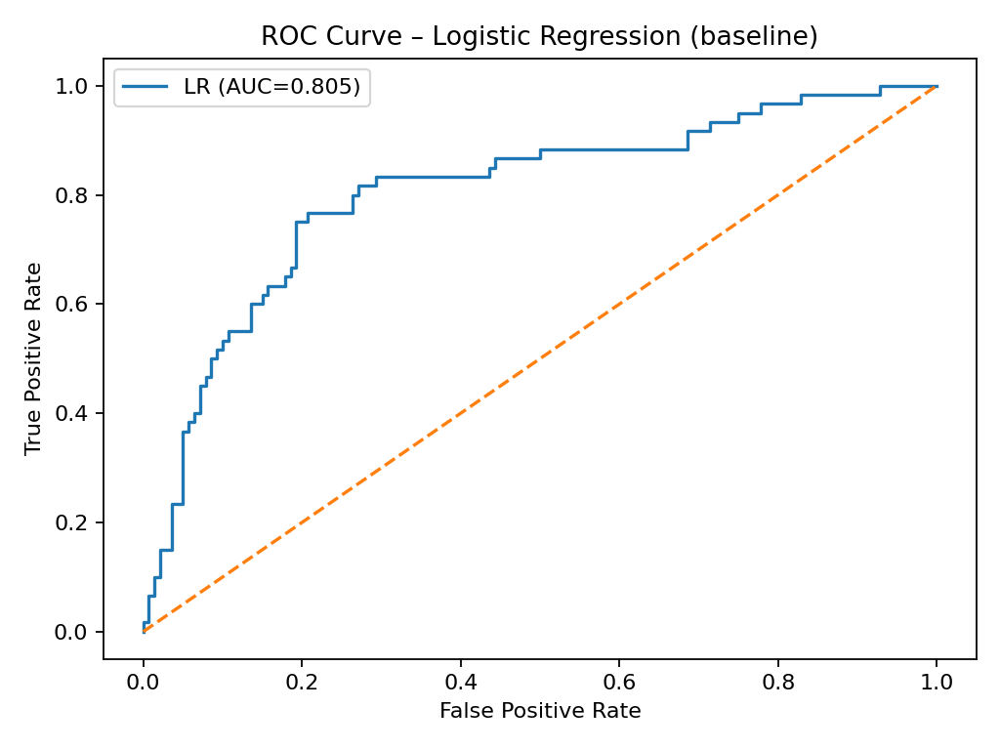
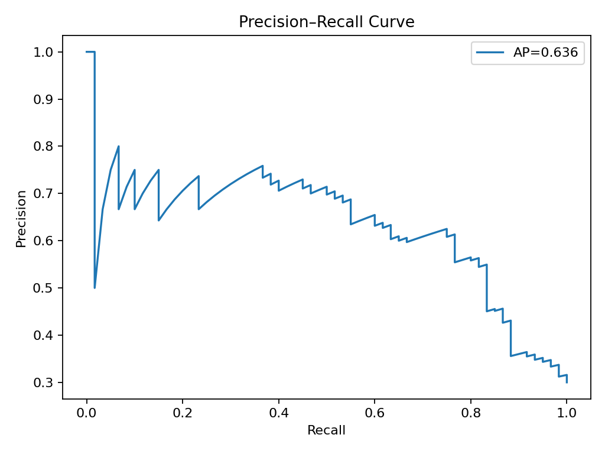
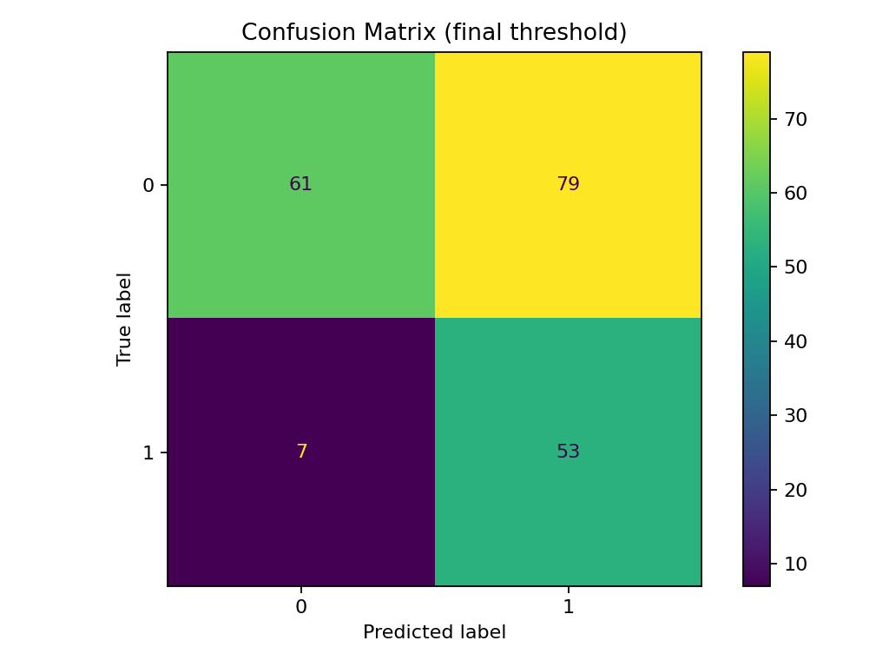

# Credit Risk Scoring (German Credit)

This repo is a small, reproducible baseline for credit risk on the German Credit dataset. Highlights:
- Clean + encode the raw data
- Simple feature engineering (`credit_per_month`, age buckets; `debt_to_income` when available)
- Train two baselines: Logistic Regression (interpretable) and Random Forest (predictive)
- Pick thresholds via F1 on a validation split
- Best test ROC-AUC: ~0.80–0.81

## Results (German Credit)

**ROC – Logistic Regression (AUC ≈ 0.805)**  


**Top LR Coefficients**  


**Precision–Recall (AP ≈ 0.636)**  


**Confusion Matrix (final threshold)**  


## Results (Test Set)

| Model                              | Thr  | ROC-AUC | Precision | Recall |  F1  |
|------------------------------------|:----:|:-------:|:--------:|:------:|:----:|
| Random Forest (validation-chosen)  | 0.234|  0.812  |   0.434  |  0.883 | 0.582 |
| Random Forest (0.5)                | 0.500|  0.812  |   0.793  |  0.383 | 0.517 |
| Logistic Regression (0.5)          | 0.500|  0.805  |   0.563  |  0.817 | 0.667 |
| Logistic Regression (best-F1)      | 0.571|  0.805  |   0.616  |  0.750 | 0.677 |

**Top drivers** (LogReg): checking account status, purpose (education), credit history, savings status  
**Top drivers** (RF): credit amount, credit per month, duration, checking status

## Results (Explanation)
I trained both Logistic Regression and Random Forest and selected the RF based on validation. On test, the model ranks risk well (ROC-AUC ≈ 0.81, AP ≈ 0.64). Using the validation-picked threshold ~0.23, it runs in a recall-heavy mode (recall ≈ 0.88, precision ≈ 0.43, F1 ≈ 0.58), with a confusion matrix of TN=71, FP=69, FN=7, TP=53. I also include the 0.5 baseline for comparison. 

That operating point is deliberate. In credit risk, missing a bad (FN) is far costlier than reviewing an extra good (FP). At 0.5 you’d see higher accuracy (~0.79) but much lower recall (~0.38; 37/60 defaulters missed). I prefer the ~0.62 accuracy that comes with high recall, since it catches most risky cases; the threshold is saved separately so it’s easy to retune as business goals change.

## How to run

### macOS / Linux
```bash
python -m venv .venv
source .venv/bin/activate
pip install -r requirements.txt
jupyter lab   # or: jupyter notebook


### macOS / Linux
```bash
python -m venv .venv
source .venv/bin/activate
pip install -r requirements.txt
jupyter lab   # or: jupyter notebook
```

### Windows (PowerShell)
```powershell
python -m venv .venv
.venv\Scripts\Activate.ps1
pip install -r requirements.txt
jupyter notebook   # or: jupyter lab
```
